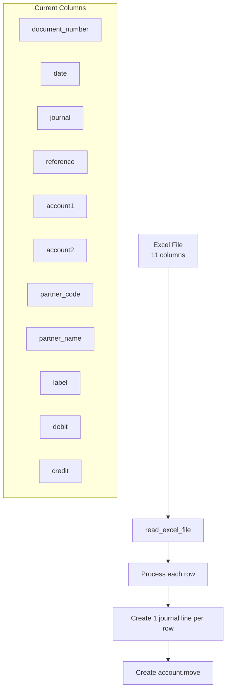
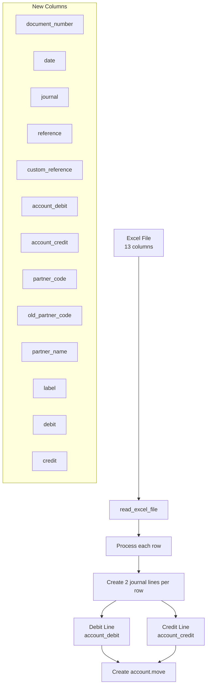

# Data Flow Diagram

## Current Implementation Flow

## New Implementation Flow

## Key Changes

1. **Column Count**: 11 → 13 columns
2. **Account Handling**: Single account → Separate debit/credit accounts
3. **Line Creation**: 1 line/row → 2 lines/row
4. **New Fields**: custom_reference, old_partner_code
5. **Partner Lookup**: Enhanced with fallback mechanism